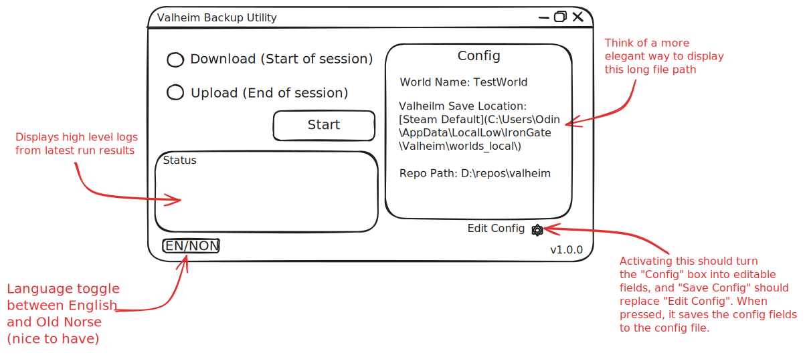

## How to run
* Double-click `run.bat`
* Alternatively, run `python src/main.py` in a terminal
* If you want to use the app via the terminal, run `python src/main.py --cli` instead

## Things to know
* Currently only supports Windows
* You should have Valheim installed already. This was developed & tested with an install via Steam.
* App assumes valheim world saves are located at `%USERPROFILE%\AppData\LocalLow\IronGate\Valheim\worlds_local`. This is not currently configurable.

## Behind the scenes
v1.0.0 mock up:
